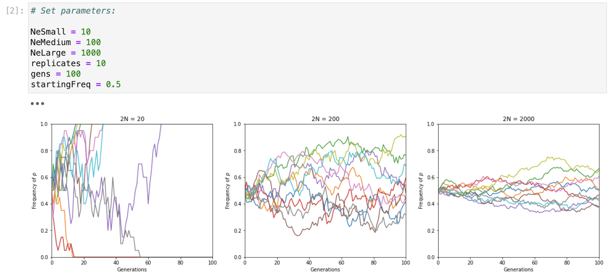

# Population Modeling

This is a repository to model biological populations and to obtain population genetic statistics.

### population.py (Dependencies: numpy, math, statistics)

The populations module has a Population class as well as other functions that are relevant to population genetics. 

- <strong>Population class</strong>
    - Attributes (only pfreq is required)
        - p and q allele frequencies  
        - AA, Aa, aa genotype frequencies  
        - Heterozygosity (assumed to be Aa unless specified)  
        - 2N  
        - Mutation rate  
        - Theta
    - Methods
        - Get H-W frequencies  
        - Get fixation index
        - Get theta-predicted heterozygosity
        - Drift-selection balance, and drift-gene flow balance  
        - Calculate probability of coalescence in discrete time
        - Simulate drift  
        - Population structure stats with another population  
        - Calculate Future heterozygosity

- <strong>Other miscellaneous functions</strong>
    - Disequilibrium stats  
    - Estimate Ne using census population sizes through time 
    - Solve Breeder's equation  
    - Calculate mean fitness  
    - Calculate exponential population growth  
    - Calculate Fst and Nem in the infinite island model
    - Calculate colony Fst in the metapopulation model

 

Example code:
```
>>> import population
>>> pop1 = population.Population(0.6, AAfreq=0.3, Aafreq=0.53, twoN=100, mutation_rate=0.01)
>>> pop1.pfreq
0.6
>>> pop1.qfreq
0.4
>>> pop1.twoN
100
>>> pop1.get_hw_freqs()
{'AA': 0.36, 'Aa': 0.48, 'aa': 0.16}
>>> pop1.get_fixation_index()
-0.1
>>> pop1.theta
4.0
>>> pop1.theta_hetero()
0.8
>>> pop1.drift_sel_balance(selection=0.03)
'4Nes: 12.0; Selection is stronger than drift.'
>>> pop1.drift_geneFlow_balance(m=0.04)
'4Nem: 16.0; Gene flow is stronger than drift.'
>>> pop1.prob_coalescence_discrete(5)
0.0096
>>> pop2 = population.Population(0.3, AAfreq=0.4, Aafreq=0.35, twoN=100)
>>> pop1.get_mix_stats(pop2)
{'F_IS': 0.02, 'F_ST': 0.09, 'F_IT': 0.11}
>>> pop1.sim_selection(wAA=1, wAa=0.98, waa=0.96)
'Delta p: 0.0049’
>>> pop1.pfreq
0.6049
>>> pop1.sim_drift(gens=100)
>>> pop1.pfreq
1
>>> pop1.future_hetero(time=5)
0.5040
>>> population.get_diseq_stats(0.5, 0, 0, 0.5)
'D: 0.25'
>>> population.get_diseq_stats(0.5, 0, 0, 0.5, p1=0.5, p2=0.5)
'D: 0.25; r2: 1.00'
>>> population.Ne_through_time([100, 10, 100])
25.0
>>> population.solve_breeders(R=50, S=100)
'h2: 0.5'
>>> population.inf_island_fst(Ne=100, m=0.03)
0.07692
>>> population.inf_island_Nem(Fst=0.09)
2.5278
>>> population.colony_fst(Fst=0.06, k=4, phi=0.2)
0.1355
>>> population.exp_growth(n0=20, r=1.05, time=10)
726310
>>> population.get_mean_fitness(0.6, wAA=1, wAa=0.98, waa=0.96)
0.984
```

### driftSimulation.py (Dependencies: matplotlib, numpy)

 This module simulates drift in replicate populations/loci of three different sizes. The user can set these sizes, along with number of replicates, generations, and starting allele frequency.

#### Example output:


